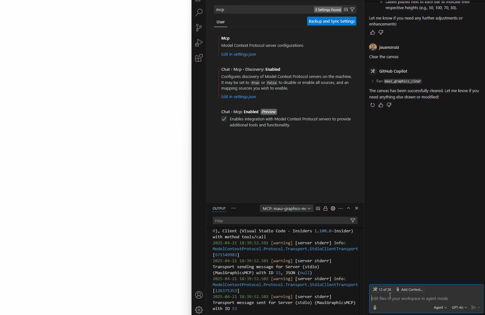
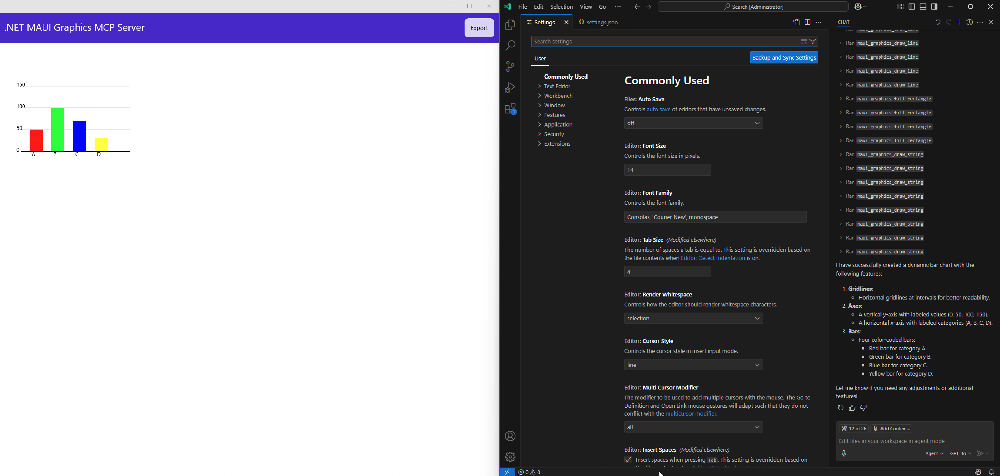
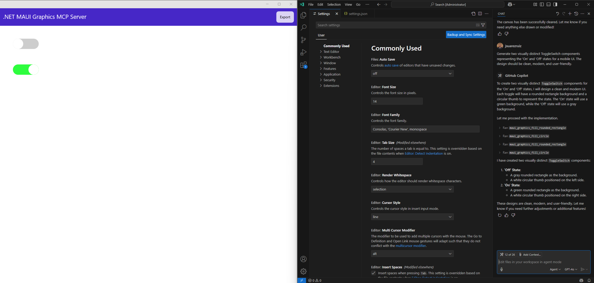
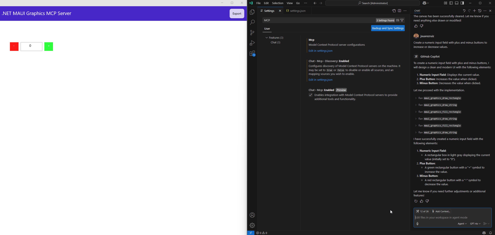
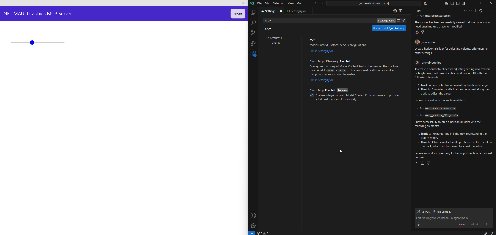

# .NET MAUI Graphics MCP Server

**Effortlessly craft stunning mobile UI components with AI, powered by the Model Context Protocol!** 🚀

This Model Context Protocol (MCP) is designed for building .NET MAUI controls, offering powerful utilities for drawing everything from basic shapes and text to intricate paths. By seamlessly combining these elements, developers can craft visually stunning UI components with precision and flexibility.

You can see what's being created in real time, and also have access to all the generated code!

### Example AI Assistant Queries

Try these queries:

* _"Generate two visually distinct ToggleSwitch components representing the 'On' and 'Off' states for a mobile UI. The design should be clean, modern, and user-friendly."_
* _"Create a dynamic bar chart with labeled axes, color-coded bars, and gridlines for easy readability."_
* _"Create a horizontal slider for adjusting volume, brightness, or other settings."_
* _"Create a numeric input field with plus and minus buttons to increase or decrease values."_

### Gallery

</img> </img> </img> </img>

### Contributing

I gladly welcome contributions to help improve this project! Whether you're fixing bugs, adding new features, or enhancing documentation, your support is greatly appreciated.

1. Fork the repository
2. Create your feature branch (git checkout -b feature/my-feature)
3. Make your changes
4. Commit your changes (git commit -m 'Add a new feature')
5. Push to the branch (git push origin feature/my-feature)
6. Open a Pull Request

### License

This project is available under the MIT License.
